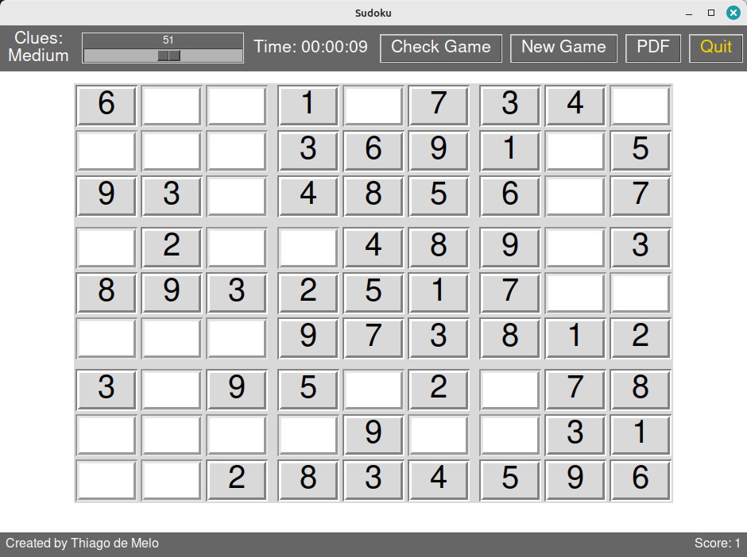
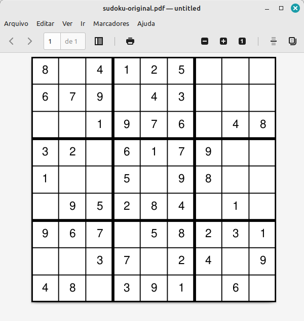

# A Simple Sudoku Game (`sudokuGUI.py`)

## How to use

Download the Python files (`sudokuGUI.py`, `sudokugenerator.py` and `sudokupdf.py`). Give execution permission to `sudokuGUI.py` with `chmod +x sudokuGUI.py` and execute it as `./sudokuGUI.py`. 

Alternatively, you can run `python3 sudokuGUI.py`.

## The main window

### Clues

Select the number of initial clues using the slider. The difficulty level changes according to the number of clues.

### New Game

After choosing the number of clues, click the `New Game` button to start the game. The clock will start and you can play by inserting numbers in the empty cells.

### Check Game

Use this button to verify your game. A feedback message will appear. 

### Score

When you finish filling the empty cells and press the `Check Game` button, if your solution is correct, you will get one point, as shown in the bottom right corner.

### PDF

If the necessary Python modules is installed, you can generate PDF files with the Sudoku grid. Press the `PDF` button and look for the files `sudoku-original.pdf` and `sudoku-solution.pdf` in the current directory.

